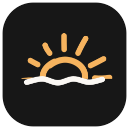
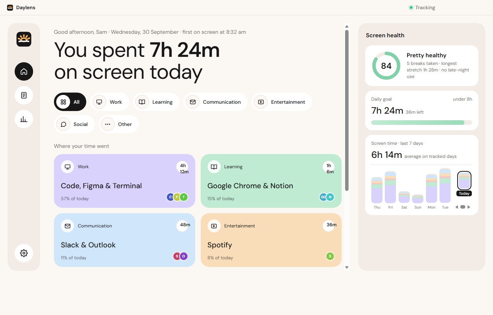
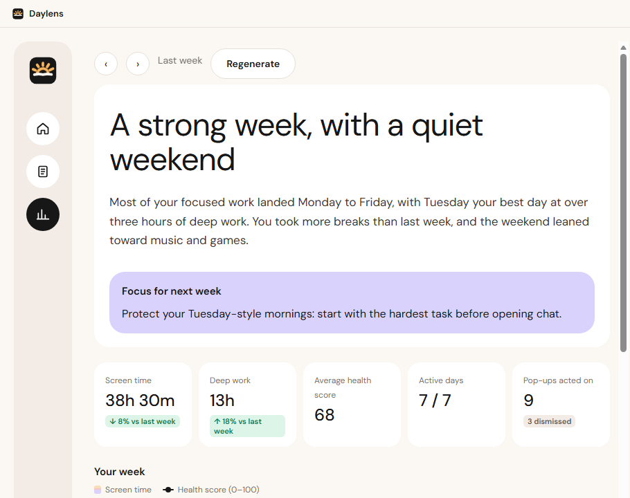
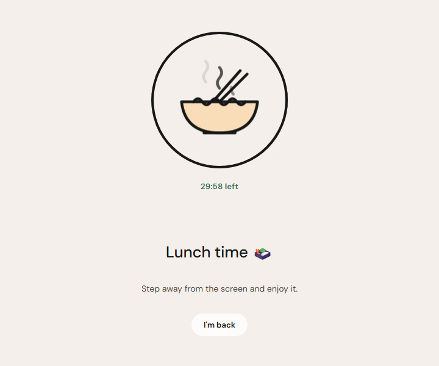
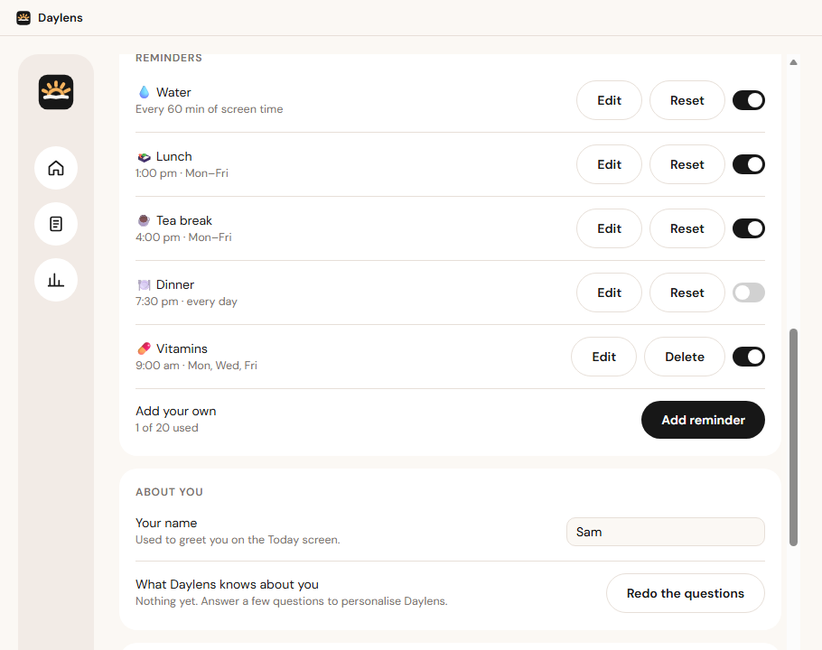

<div align="center">



# Daylens

**See your day clearly.**

A private, on-device companion for Windows that shows where your screen time goes, writes you a daily and weekly report, and nudges you toward healthier habits — breaks, water, meals and more.

[](https://github.com/aaron-sequeira/WorkSight/releases/latest)




</div>

---

## Contents

- [Features](#features)
- [Privacy](#privacy)
- [Install](#install)
- [Screenshots](#screenshots)
- [Development](#development)
- [Repository layout](#repository-layout)
- [Tech stack](#tech-stack)
- [Credits](#credits)

## Features

### Understand your day
- **Automatic tracking** of the app and window in front, grouped into Work, Learning, Communication, Entertainment, Social and Other.
- **Today view** with a timeline, where your time went, a daily screen-time goal and a 7-day trend.
- **Screen health score** (0–100) from breaks taken, long stretches, late-night use and your goal.
- **On-device understanding (optional):** Daylens can read the text of the window in front — never screenshots — and label what you were doing with **Laya**, a text classifier that runs entirely on your PC.

### Reports that write themselves
- **Daily report** in plain language: what went well, what to try tomorrow, and the day in detail (apps, sites, videos, games, learning).
- **Weekly Insights** with an AI-written week summary, deep-work trends and your top apps.
- Written **on your PC** by a local model (Qwen3 4B / 1.7B) when memory allows, or in the cloud with **your own API key** (Anthropic, OpenAI, Gemini, OpenRouter or a custom endpoint).
- **Search** every past report, **export to PDF**, auto-save PDFs to a folder, or draft an **email** in one click.

### Coaching, breaks and reminders
- Gentle **pop-ups** for eye breaks, stretching, wind-down, doom-scrolling and daily goals — held automatically during calls, full-screen video and focus blocks.
- **Reminders** for water, lunch, tea and dinner, plus up to 20 of your own (vitamins, a call, anything), each on a time and days or every *N* minutes of screen time.
- **Animated break screens** — hand-drawn scenes (a filling water bottle, a steaming bowl, a cup of tea…) that play for the length of the break, on every monitor.

### Travel and time zones
- Daylens **follows your time zone automatically** when Windows changes it; reminder times always mean local time, and past days keep their real hours.
- **Travel mode** after a jump of 3+ hours: a short jet-lag plan (daylight, caffeine cut-off, naps, water) and a few well-timed reminders for the first days.

## Privacy

- **Everything stays on your PC** — no account, no sign-up, no analytics.
- Screen reading is **opt-in**, text only (never screenshots), respects an exclusion list (password managers, banking, private windows…) and keeps raw text for as little as a day.
- The cloud writer is **off unless you add your own API key**, and then only receives app names and window titles — never screen text.
- **Export** or **delete** all of your activity from *Settings → Privacy* at any time.

## Install

1. Download **`Daylens-Setup-1.0.0.exe`** from the [latest release](https://github.com/aaron-sequeira/WorkSight/releases/latest).
2. Run it. The installer is not code-signed yet, so Windows may show *“Windows protected your PC”* — choose **More info → Run anyway**.
3. Daylens installs just for you (no admin rights needed), opens itself, and starts with Windows from then on.

**Requirements:** Windows 10 (1903 or later) or Windows 11, 64-bit. The optional on-device models download on first use (Laya ≈ 1.7 GB, writer ≈ 1.1–2.5 GB); 8 GB of RAM or more is recommended for writing reports on your PC.

To uninstall, use *Settings → Apps*. You'll be asked whether to also delete your history and downloaded models (the default keeps them).

## Screenshots

<table>
  <tr>
    <td width="50%"><p align="center"><b>Weekly Insights</b> — an AI-written summary of your week</p></td>
    <td width="50%"><p align="center"><b>Break screens</b> — a hand-drawn animation for every reminder</p></td>
  </tr>
  <tr>
    <td colspan="2"><p align="center"><b>Reminders</b> — built-ins you can edit, plus your own</p></td>
  </tr>
</table>

## Development

Prerequisites: **Node.js 20+**, **pnpm 9**, Windows 10/11.

```bash
pnpm install                                   # install the whole workspace
pnpm --filter @worksight/consumer dev          # run Daylens in development
pnpm --filter @worksight/consumer test         # unit tests (Vitest)
pnpm -r typecheck                              # type-check every package
pnpm --filter @worksight/consumer dist         # build the Windows installer → apps/consumer/release/
pnpm --filter @worksight/consumer logo         # regenerate the logo, app icon and tray icons
```

> Native modules (better-sqlite3) are rebuilt for Electron before `dev`/`dist` and for Node before `test`. If the dev app is running and holding the database, run the tests under Electron's Node instead:
> `ELECTRON_RUN_AS_NODE=1 ../../node_modules/electron/dist/electron.exe ../../node_modules/vitest/vitest.mjs run` (from `apps/consumer`).

Design specs and implementation plans for every phase live in [`docs/superpowers/`](docs/superpowers).

## Repository layout

| Path | What it is |
|---|---|
| [`apps/consumer`](apps/consumer) | **Daylens** — the consumer desktop app (Electron + React) |
| [`apps/agent`](apps/agent) | WorkSight Agent — the original local-only desktop activity tracker |
| [`apps/web`](apps/web) | WorkSight web app |
| [`packages/core`](packages/core) | Shared tracking, SQLite storage and roll-ups used by both desktop apps |
| [`docs`](docs) | Specs, plans and README images |

## Tech stack

- **Electron 33**, **React 19**, **TypeScript**, bundled with **electron-vite**
- **SQLite** via better-sqlite3 (FTS5 for report search)
- **onnxruntime-node** for the on-device Laya classifier
- **node-llama-cpp** (CPU + Vulkan) for the on-device report writer
- Windows OCR and WinRT through a small PowerShell helper
- **Vitest** for tests, **electron-builder** (NSIS) for the installer

## Credits

- Report writer: [Qwen3](https://huggingface.co/Qwen) by Alibaba Cloud (Apache-2.0), GGUF builds by [Unsloth](https://huggingface.co/unsloth).
- On-device labelling: Laya, exported to ONNX ([`aaronalexS/daylens-laya-onnx`](https://huggingface.co/aaronalexS/daylens-laya-onnx)).
- Typeface: [DM Sans](https://fonts.google.com/specimen/DM+Sans) (SIL Open Font License).
